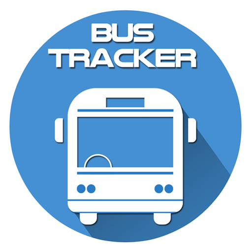

# RealTime-Bus-Tracking
This project will demonstrate the movement of a bus from one place to it's destination.

When you is press the button show stops between MIT and Harvard, the position of the bus tracker map will change following the bus route in different bus stops.

